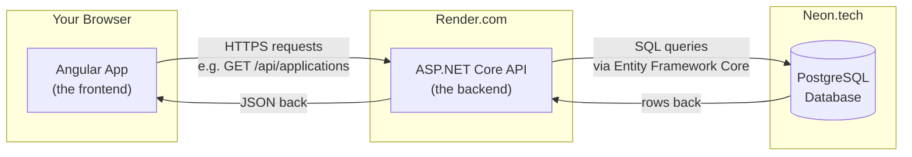

# 1. Architecture — The Big Picture

## What CareerPilot actually is

CareerPilot is a job-application tracker. Instead of a spreadsheet, you get a proper app: log
every company you've applied to, every recruiter you're talking to, every interview you've got
scheduled, every follow-up reminder you owe someone, and (once you're lucky enough to have them)
every offer, laid out side by side so you can compare them.

It is a **full-stack** application, which just means: there's a piece that runs in your browser
(the "frontend") and a separate piece that runs on a server somewhere and owns the data (the
"backend"), and they talk to each other over the network using HTTP requests, the same way your
browser talks to any website.

## The three deployed pieces



Three separate companies host three separate pieces:

| Piece | What it is | Hosted on | Why there |
|---|---|---|---|
| **Frontend** | The Angular app — everything you see and click | [Vercel](https://vercel.com) | Vercel is built specifically for hosting static/JS frontend builds; free tier, fast global CDN |
| **Backend** | The ASP.NET Core API — the "brain" that enforces rules and talks to the database | [Render](https://render.com) | Render runs long-lived server processes (Docker containers) for free/cheap, which Vercel doesn't do for a .NET app |
| **Database** | PostgreSQL, where every row of real data actually lives | [Neon](https://neon.tech) | Neon is "serverless Postgres" — a managed Postgres database with a generous free tier, no server to maintain yourself |

This split (frontend / backend / database on three different providers) is completely normal for
a modern web app and is *why* you see three separate URLs if you go looking:

- Frontend: `https://career-pilot-brown.vercel.app`
- Backend: `https://careerpilot-api-ty6d.onrender.com`
- Database: a Neon connection string (never exposed to the browser — only the backend knows it)

## Why split it into two apps at all?

A newcomer's first question is often: why not just build one app that does everything? The
short answer: **the browser cannot be trusted.**

Anyone can open your browser's dev tools and read every line of JavaScript your app sends them,
inspect every request, and change any value before it's sent. If the "is this the right
password?" check, or the "does this application belong to this user?" check, lived in the
frontend, anyone could bypass it trivially. So the rule is:

> **The frontend is for presentation. The backend is for decisions.**

The frontend's job is to look good and be pleasant to use. The backend's job is to be the one
place that actually decides "yes, you're allowed to see this" or "no, that password is wrong" —
because the backend runs on a server the user never gets direct access to.

You'll see this rule play out concretely in this codebase: every single API endpoint that touches
user data re-checks "does this row actually belong to the logged-in user?" **on the server**,
even though the frontend already only *shows* you your own data. That's not redundant — the
frontend check is for UX, the backend check is for security.

## Rate limiting on the public endpoints

`AuthController` (register, login, refresh, forgot-password, reset-password, logout) is the only
part of the API anyone can call *without* already being logged in — which also makes it the only
part an anonymous script can hammer. Every endpoint on that controller shares one rate-limit
policy, keyed by the caller's IP address: 10 requests per minute in production. Go over that and
the response is `429 Too Many Requests` with a plain-language message, before the request ever
reaches a controller method, a BCrypt hash, or a database write. This closes off credential
stuffing against `/login`, someone mailbombing a stranger via repeated `/forgot-password` calls,
and cheap CPU-exhaustion attempts against the password hashing itself — the kind of gap that's
easy to miss because everything still "works" in normal manual testing, right up until it's
abused. See [03-BACKEND.md](./03-BACKEND.md) for how the limit is wired up (and why it's read from
configuration instead of hardcoded).

## Tech stack, and why each piece was chosen

| Layer | Technology | Why |
|---|---|---|
| Frontend framework | **Angular 19** (standalone components, Signals) | A complete, opinionated framework — routing, forms, HTTP client, dependency injection all built in and designed to work together, rather than assembled from separate libraries |
| Frontend language | **TypeScript** | JavaScript with a type checker bolted on — catches a huge class of "I passed the wrong shape of object" bugs before the code ever runs |
| Backend framework | **ASP.NET Core (.NET 10)** | Microsoft's modern, cross-platform web framework — fast, strongly typed, with first-class support for the patterns used here (dependency injection, JWT auth, EF Core) |
| Backend language | **C#** | Statically typed, compiled — same "catch mistakes before runtime" benefit as TypeScript, on the server side |
| Database | **PostgreSQL** | A mature, open-source relational database — "relational" meaning data is organized into tables with defined relationships between them (a `Recruiter` *belongs to* a `Company`, an `Interview` *belongs to* a `JobApplication`, etc.) |
| Database access | **Entity Framework Core (EF Core)** | An "ORM" (Object-Relational Mapper) — lets the C# code work with `Company` and `Recruiter` as normal C# classes/objects instead of hand-writing SQL everywhere. Covered in depth in [02-DATABASE.md](./02-DATABASE.md) |
| Authentication | **JWT (JSON Web Tokens)** + a custom refresh-token system | Explained fully in [04-AUTHENTICATION.md](./04-AUTHENTICATION.md) |

## The request lifecycle, concretely

To make the diagram above less abstract, here's exactly what happens when you open the
Applications page:

1. **Browser** loads `https://career-pilot-brown.vercel.app/applications`. Vercel serves the
   already-built Angular files (HTML/CSS/JS) — no backend involved yet, this is just static files.
2. **Angular** boots up in your browser, sees the URL matches the `applications` route, and
   instantiates `ApplicationListComponent`.
3. That component's constructor calls a method on `ApplicationsService`, which fires an HTTP
   `GET` request to `https://careerpilot-api-ty6d.onrender.com/api/applications`.
4. Two Angular **interceptors** (small pieces of middleware) touch that request on the way out:
   `authInterceptor` attaches your login token as an `Authorization` header; `errorInterceptor`
   is set up to catch the response if something goes wrong (covered in
   [04-AUTHENTICATION.md](./04-AUTHENTICATION.md)).
5. **Render** receives the HTTP request and hands it to the running ASP.NET Core process.
6. ASP.NET Core's routing finds `JobApplicationsController.GetAll()` matches
   `GET /api/applications`, checks the `[Authorize]` attribute (rejects the request right here
   with `401 Unauthorized` if the token is missing/invalid/expired), then runs the method.
7. Inside that method, EF Core translates C# LINQ code (`db.JobApplications.Where(...)`) into an
   actual SQL `SELECT` statement and sends it to **Neon**.
8. Neon runs the query against the real Postgres tables and returns rows.
9. EF Core turns those rows back into C# objects, the controller shapes them into a JSON response
   (deliberately *not* the raw database rows — see the DTO pattern in
   [03-BACKEND.md](./03-BACKEND.md)), and sends it back.
10. Angular receives the JSON, the service updates a **Signal** holding the list of applications,
    and because the template reads that Signal, the screen updates automatically — no manual
    "now redraw the DOM" code anywhere. Signals are explained in depth in
    [05-FRONTEND.md](./05-FRONTEND.md).

Every single feature in this app is some variation of that same ten-step dance. Once you
understand it for one endpoint, you understand it for all of them.

## Repository layout

```
Carrier-pilot/
├── Backend/
│   ├── CareerPilot.Api/          ← the ASP.NET Core project (see 03-BACKEND.md)
│   │   ├── Controllers/          ← one file per resource (Companies, Recruiters, Auth, ...)
│   │   ├── Models/                ← the C# classes EF Core maps to database tables
│   │   ├── Dtos/                  ← the shapes actually sent over the wire (see 03-BACKEND.md)
│   │   ├── Services/               ← things that don't belong in a controller (token creation, email sending)
│   │   ├── Data/AppDbContext.cs    ← the EF Core "gateway" to the database (see 02-DATABASE.md)
│   │   ├── Migrations/             ← the history of every database schema change (see 02-DATABASE.md)
│   │   └── Program.cs              ← where the whole app is wired together at startup
│   └── CareerPilot.Api.Tests/      ← automated backend tests
└── Frontend/career-pilot/
    └── src/app/
        ├── core/                   ← app-wide singletons: auth service, guards, HTTP interceptors
        ├── features/                ← one folder per screen/feature (applications, companies, ...)
        ├── shared/                  ← reusable pieces: models (TypeScript types), small components, pipes
        └── shell/                   ← the sidebar + layout that wraps every logged-in page
```

Next: [02-DATABASE.md](./02-DATABASE.md) — how the database was actually built, table by table.
