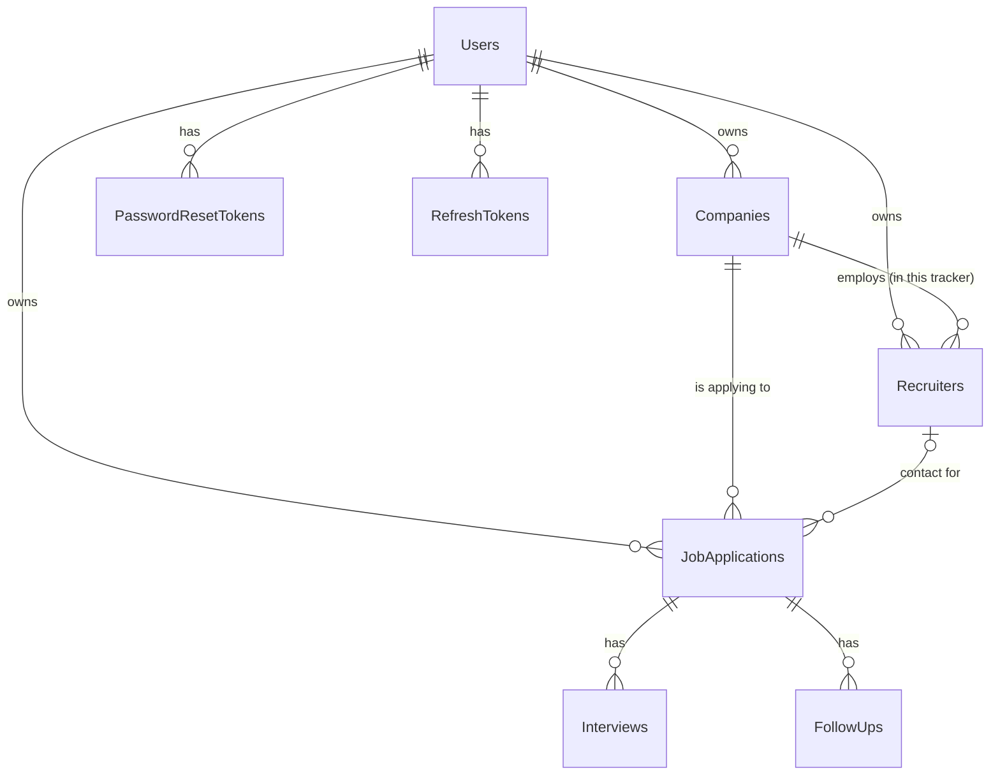

# 2. Database — From Zero to Every Table

## What a relational database actually is

If you've only used spreadsheets, think of a database as a workbook with several sheets
("tables"), where the sheets are allowed to reference rows in *other* sheets by ID instead of
duplicating data. A `Recruiter` row doesn't repeat the company's name and website — it just
stores the company's numeric ID, and the "real" company data lives once, in the `Companies`
table. That's what "relational" means: data lives in one place, and other tables **relate** to it
by reference.

PostgreSQL ("Postgres") is the actual database engine — a program that stores this data on disk,
enforces the rules you define (a `JobApplication` *must* have a `CompanyId` that points to a real
company; two `Users` can't have the same email), and answers queries.

**Neon** is not a different database — it's Postgres, hosted for you. You don't install
PostgreSQL, manage backups, or provision a server; you get a connection string and Neon runs the
actual database somewhere in the cloud. This project's local development database and its
production database are, in fact, *the same Neon database* — there's no separate "dev database";
everyone doing local testing reads and writes the one real database, scoped by which user account
is logged in.

## What EF Core is, and the "Code-First" idea

Entity Framework Core (EF Core) is a library that lets C# code talk to the database without
writing raw SQL by hand. You write ordinary C# classes:

```csharp
// Backend/CareerPilot.Api/Models/Company.cs
public class Company
{
    public int Id { get; set; }
    public int UserId { get; set; }
    public User? User { get; set; }
    public string Name { get; set; } = string.Empty;
    public string? Country { get; set; }
    public string? Website { get; set; }
    public string? Notes { get; set; }
}
```

...and EF Core figures out that this should become a `Companies` table with columns `Id`,
`UserId`, `Name`, `Country`, `Website`, `Notes`. When your C# code does:

```csharp
db.Companies.Add(new Company { UserId = 12, Name = "Acme Corp" });
await db.SaveChangesAsync();
```

EF Core translates that into an actual `INSERT INTO "Companies" (...) VALUES (...)` SQL statement
and sends it to Postgres. You never write that SQL yourself — you write C#, and EF Core is the
translator.

This project uses the **"Code-First"** approach: the C# model classes are the source of truth,
and the actual database schema is *generated from* those classes via **migrations** (next
section). The alternative — "Database-First" — is designing the tables directly in SQL and
generating C# classes from them. Code-First is more common for projects like this because the
whole schema history lives in the C# codebase, in git, reviewable as a diff.

## Migrations: how a new table actually gets created

This is the part that confuses people most, so let's walk through it concretely using the
`FollowUps` table as a real example (it was added partway through this project, not from day
one).

**Step 1 — write the C# model.**

```csharp
// Backend/CareerPilot.Api/Models/FollowUp.cs
public class FollowUp
{
    public int Id { get; set; }
    public int JobApplicationId { get; set; }
    public JobApplication? JobApplication { get; set; }
    public string Note { get; set; } = string.Empty;
    public DateTime DueDate { get; set; }
    public bool IsDone { get; set; }
    public DateTime? CompletedAt { get; set; }
}
```

**Step 2 — register it with EF Core.** Just having the class isn't enough; EF Core needs to be
told it should track this class as a table:

```csharp
// Backend/CareerPilot.Api/Data/AppDbContext.cs
public DbSet<FollowUp> FollowUps => Set<FollowUp>();
```

A `DbSet<T>` is EF Core's handle for "the collection of all rows in this table." `db.FollowUps` is
how every controller queries or adds follow-ups.

**Step 3 — describe the relationship.** How does EF Core know `FollowUp` belongs to exactly one
`JobApplication`, and that deleting an application should delete its follow-ups too (rather than
leaving orphaned rows, or blocking the delete)? That's configured explicitly:

```csharp
// still in AppDbContext.cs, inside OnModelCreating()
modelBuilder.Entity<FollowUp>(entity =>
{
    entity.HasOne(f => f.JobApplication)
        .WithMany(a => a.FollowUps)
        .HasForeignKey(f => f.JobApplicationId)
        .OnDelete(DeleteBehavior.Cascade);
});
```

`DeleteBehavior.Cascade` means: delete the parent, and every child row referencing it gets
deleted automatically, by the *database itself* — not by application code looping through and
deleting things one at a time.

**Step 4 — generate a migration.** With the model and relationship written, you run:

```bash
dotnet ef migrations add AddFollowUps
```

EF Core compares the current shape of your C# models against the last known database shape (it
tracks this in a file called `AppDbContextModelSnapshot.cs`) and generates a new file describing
*only the difference* — in this case, "create a new table called FollowUps with these columns and
this foreign key." That generated file lives at
`Backend/CareerPilot.Api/Migrations/<timestamp>_AddFollowUps.cs` and looks like this (simplified):

```csharp
protected override void Up(MigrationBuilder migrationBuilder)
{
    migrationBuilder.CreateTable(
        name: "FollowUps",
        columns: table => new
        {
            Id = table.Column<int>(type: "integer", nullable: false)
                .Annotation("Npgsql:ValueGenerationStrategy", NpgsqlValueGenerationStrategy.IdentityByDefaultColumn),
            JobApplicationId = table.Column<int>(type: "integer", nullable: false),
            Note = table.Column<string>(type: "text", nullable: false),
            DueDate = table.Column<DateTime>(type: "timestamp with time zone", nullable: false),
            IsDone = table.Column<bool>(type: "boolean", nullable: false),
            CompletedAt = table.Column<DateTime>(type: "timestamp with time zone", nullable: true)
        },
        constraints: table =>
        {
            table.PrimaryKey("PK_FollowUps", x => x.Id);
            table.ForeignKey(
                name: "FK_FollowUps_JobApplications_JobApplicationId",
                column: x => x.JobApplicationId,
                principalTable: "JobApplications",
                principalColumn: "Id",
                onDelete: ReferentialAction.Cascade);
        });
}
```

Every migration also has a matching `Down()` method — the exact reverse operation (here,
`DropTable`), used if you ever need to roll a migration back.

**Step 5 — apply it to the real database.**

```bash
dotnet ef database update
```

*This* is the command that actually connects to Neon and runs the `CREATE TABLE` statement. Until
this runs, the migration file exists in your codebase but the table doesn't exist in the real
database yet — the C# model, the migration file, and the live database schema are three separate
things that have to be kept in sync deliberately.

EF Core tracks which migrations have already been applied in a special table it manages itself,
`__EFMigrationsHistory` — one row per migration, so re-running `database update` is always safe;
it only applies migrations that haven't run yet.

### A real complication worth knowing about

On the Windows machine this project was developed on, `dotnet ef` intermittently got blocked by a
Windows security feature (Application Control policy) that distrusts freshly-compiled,
unsigned `.dll` files the first time they appear. The fix was never to bypass that security
control — just to rebuild and retry until the block cleared, sometimes with a full machine
restart. This is mentioned here because it's a real thing you may hit in this exact environment,
not a mistake in the project itself.

## Every table in this database

| Table | What it stores | Key relationships |
|---|---|---|
| **Users** | One row per registered account: email, bcrypt password hash, display name | Everything else ultimately belongs to a `User` |
| **Companies** | Companies you're applying to | belongs to a `User` |
| **Recruiters** | Your contacts at each company | belongs to a `User` *and* a `Company` |
| **JobApplications** | The core record: role, status, applied date, and (added later) salary/work mode/offer deadline/benefits for offer comparison | belongs to a `User`, a `Company`, optionally a `Recruiter` |
| **Interviews** | Interview rounds tied to an application | belongs to a `JobApplication` |
| **FollowUps** | Reminders tied to an application | belongs to a `JobApplication` |
| **PasswordResetTokens** | Short-lived, hashed tokens for the "forgot password" flow | belongs to a `User` |
| **RefreshTokens** | Longer-lived, hashed tokens that let the app issue new login sessions without asking for a password again — see [04-AUTHENTICATION.md](./04-AUTHENTICATION.md) | belongs to a `User` |



## The most important pattern in the whole schema: per-user ownership

Every table except `Users` itself has a `UserId` column (or reaches a `UserId` indirectly, like
`Interview` → `JobApplication` → `UserId`). This is what makes it safe for many different people
to use the same running app and database without ever seeing each other's data.

It's enforced in two places, deliberately redundant:

1. **Every query filters by it.** Every single controller method does something like:
   ```csharp
   var userId = User.GetUserId(); // pulled from the JWT, not from anything the client sent
   var company = await db.Companies.SingleOrDefaultAsync(c => c.Id == id && c.UserId == userId);
   ```
   Notice: it's not "find company by id, then check if it belongs to this user" — it's baked
   directly into the `WHERE` clause. If someone else's company ID is requested, the query simply
   returns nothing (`404 Not Found`), because as far as that SQL query is concerned, a company
   with that ID *owned by this user* doesn't exist. This is the standard defense against **IDOR**
   (Insecure Direct Object Reference) — a very common real-world vulnerability class where an app
   forgets this check and lets user A fetch `/api/companies/17` even though company 17 belongs to
   user B.

2. **Cascading deletes clean up automatically — as a backstop, not a shortcut.** Every table's
   foreign key is configured with `DeleteBehavior.Cascade` at the database level, so deleting a
   `User` (or a `JobApplication`) deletes everything that hangs off it — you never end up with
   orphaned rows pointing at a parent that no longer exists. Deleting a `Company` is the one
   exception the API deliberately guards: `CompaniesController.Delete` checks for attached
   `JobApplications`/`Recruiters` first and refuses with `409 Conflict` if there are any, rather
   than silently cascading away a user's entire application history for that company. The
   database-level cascade is still configured underneath (so the `Users`-level cascade above still
   works, and nothing is ever *technically* blocked from cascading) — it's just that the one path a
   normal user could trigger by clicking "Delete" on a company is deliberately intercepted before
   it gets there.

## Connection strings and where they live

The backend needs one secret to talk to Neon: the connection string (host, database name,
username, password, all in one string). It is **never** committed to git. Locally, it's stored
via .NET's "user secrets" mechanism (a JSON file outside the repo, tied to the project by a GUID
in the `.csproj` file). In production on Render, it's set as an environment variable
(`ConnectionStrings__DefaultConnection` — the double underscore is .NET's convention for nesting
into `ConnectionStrings:DefaultConnection`). `Program.cs` reads it with:

```csharp
var connectionString = builder.Configuration.GetConnectionString("DefaultConnection")
    ?? throw new InvalidOperationException("Connection string 'DefaultConnection' is not configured. ...");
```

If it's missing, the app refuses to start with a clear error rather than starting broken.

Next: [03-BACKEND.md](./03-BACKEND.md) — how the ASP.NET Core API is actually put together.
