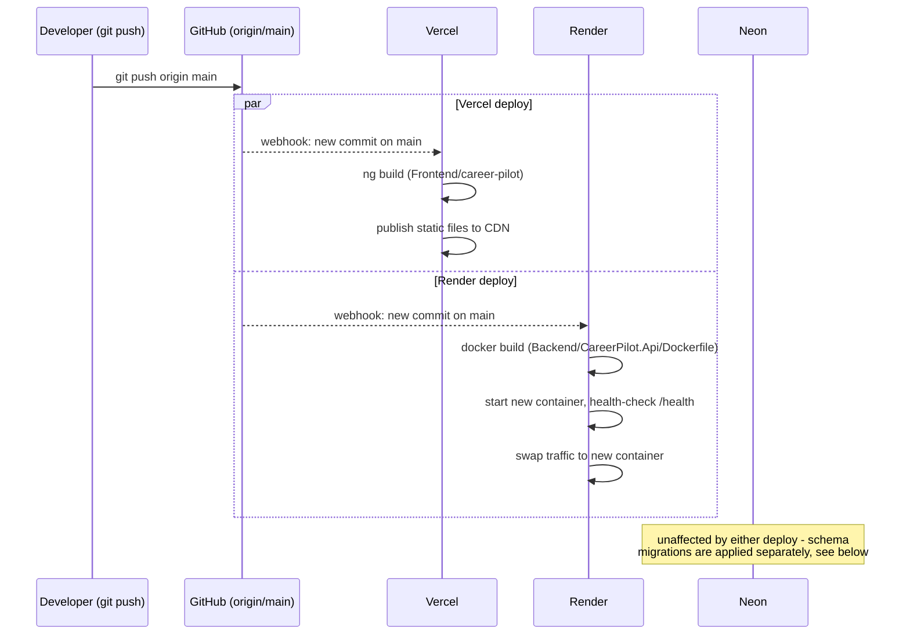

# 7. Deployment — From Your Editor to the Live Site

## The three hosting providers, and what each one watches

Recall from [01-ARCHITECTURE.md](./01-ARCHITECTURE.md) that three separate services host the
three pieces of this app. Two of them are connected directly to this GitHub repository and
**deploy automatically** whenever code is pushed:

| Provider | Watches | Builds and deploys |
|---|---|---|
| **Vercel** | `origin/main` on GitHub, the `Frontend/career-pilot` folder | Runs `ng build`, publishes the resulting static files to its CDN |
| **Render** | `origin/main` on GitHub, the `Backend/CareerPilot.Api` folder | Builds the Docker image (`Dockerfile`), starts a new container, swaps traffic to it |
| **Neon** | Nothing — it's just a database | Does not deploy anything; migrations are applied to it manually (below) |

There is **no separate CI/CD pipeline file** in this project (no GitHub Actions workflow) — the
"pipeline" is entirely each hosting provider's own built-in "watch this branch and rebuild"
behavior. This is a reasonable, common choice for a solo project at this scale: it's zero
configuration to set up, at the cost of not running automated tests as a *gate* before deploy (the
backend test suite exists and can be run manually with `dotnet test`, but nothing currently stops
a push from deploying even if those tests would fail).

## The actual deploy flow, step by step



Both deploys happen **in parallel**, triggered by the same push, and are **completely
independent** of each other — Vercel doesn't know or care whether Render's build succeeded, and
vice versa. This is worth knowing because it means a bad backend deploy doesn't roll back the
frontend automatically, and there can be a brief window where a newly-deployed frontend is
talking to a not-yet-updated backend (or the reverse) if a change requires both sides to update
together — see the migrations note below for how this project handles that specific case.

## Database migrations are **not** part of the automatic deploy

This is the single most important thing to understand about this project's deployment: pushing
code to `main` does **not** run `dotnet ef database update` against the production database.
Render only builds and starts the backend container — it does not run migrations as part of that
process.

Migrations are applied **manually**, deliberately, as a separate step:

```bash
dotnet ef database update
```

run from a machine with the production connection string configured (in this project's actual
development history, this was run directly against the shared Neon database from the local dev
machine — recall from [02-DATABASE.md](./02-DATABASE.md) that there is only one real database,
not a separate "dev" copy).

**Why this matters in practice:** if you add a new required database column and push the backend
code that expects it *before* running the migration, the live backend will start throwing errors
the moment it tries to query that column, because the column doesn't exist in the real database
yet. The safe order, always, is:

1. Write the migration.
2. Apply it to the real (Neon) database with `dotnet ef database update`.
3. *Then* push the backend code that relies on the new column.

Every feature in this project that touched the database (Follow-ups, the recruiter mobile number,
refresh tokens, Offer Comparison fields) followed exactly this order — migration applied first,
confirmed successful, only then pushed.

## Environment variables and secrets

Neither the database connection string, the JWT signing key, nor the SMTP email credentials are
ever committed to the repository. Locally, they live in .NET's **user secrets** (a JSON file
stored outside the project folder, in your user profile, referenced by a GUID in the `.csproj`
file — so it's tied to the project without living inside it). In production on Render, the exact
same configuration keys are set as **environment variables** on the service itself, through
Render's dashboard — never in code, never in git history.

.NET's configuration system reads both the same way, using a naming convention: a config key like
`Jwt:Key` becomes the environment variable `Jwt__Key` (double underscore stands in for the colon,
since most operating systems don't allow colons in environment variable names). This is why you'll
see double-underscore names if you ever look at Render's environment variable settings for this
project.

## What a full local development setup looks like

To run this project on your own machine (not against production, though as noted this project's
actual local setup does point at the same real Neon database — you could equally point it at your
own separate Neon project by changing the connection string):

1. **Backend:** `cd Backend/CareerPilot.Api`, set the required secrets via `dotnet user-secrets
   set "..."` (connection string, JWT key), then `dotnet ef database update` to make sure your
   target database has every migration applied, then `dotnet run`. It listens on
   `http://localhost:5287` by default.
2. **Frontend:** `cd Frontend/career-pilot`, `npm install`, then `ng serve --port 4325` (or
   whatever port; the frontend's `environment.ts` points at `http://localhost:5287/api` for local
   dev specifically, versus `environment.prod.ts` pointing at the real Render URL for the
   production build).

Both need to be running simultaneously for the app to actually work locally — the frontend alone
can render its login page, but every API call will fail without the backend also running.

## A note on this specific machine's quirks

If you're picking this project up on the same Windows machine it was originally built on, you may
encounter a Windows security feature (Application Control policy) intermittently blocking freshly
compiled `.dll` files from running, with an error like:

```
Unhandled exception. System.IO.FileLoadException: Could not load file or assembly '...'.
An Application Control policy has blocked this file. (0x800711C7)
```

This is not a bug in the project — it's a security control on that specific machine reacting to
a binary it hasn't "seen" before. It has always cleared up either by retrying the build/run a few
times, or (when it didn't clear on its own) by restarting the machine. It is not something to
work around by disabling the security feature itself.
